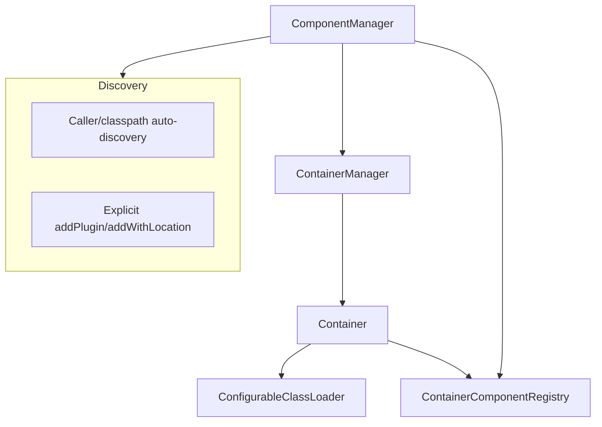
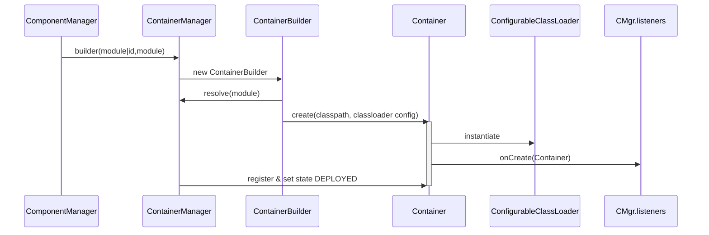
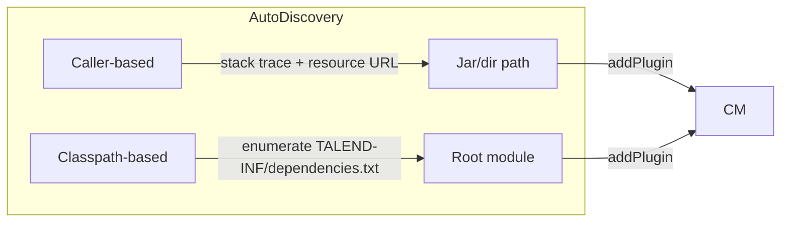
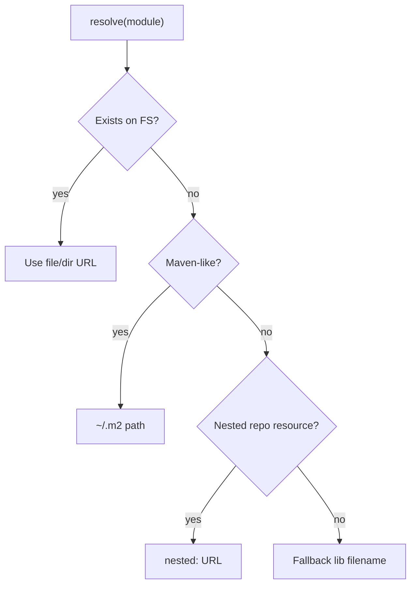
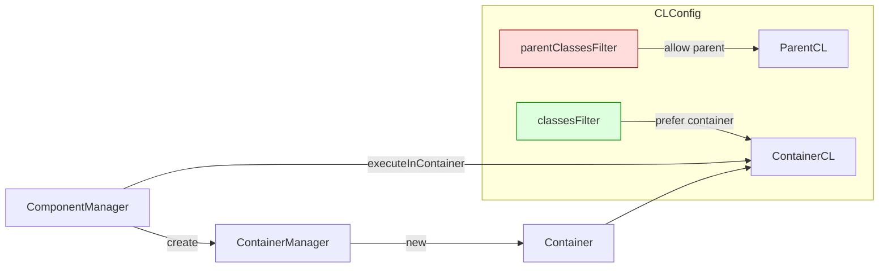
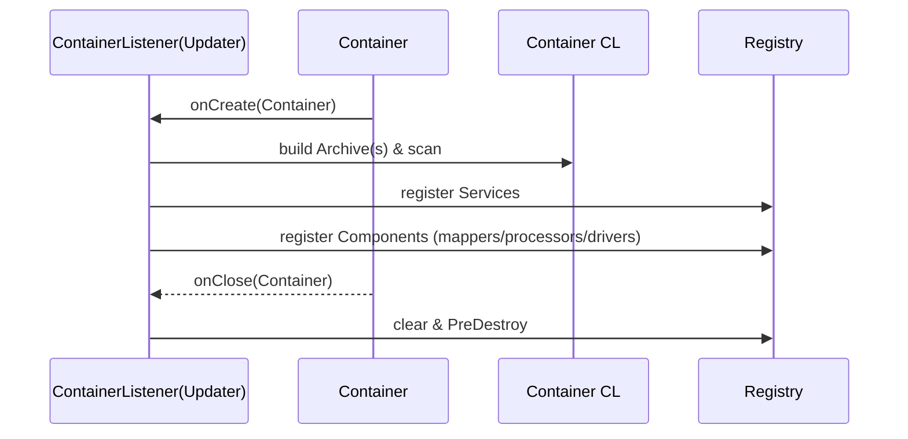
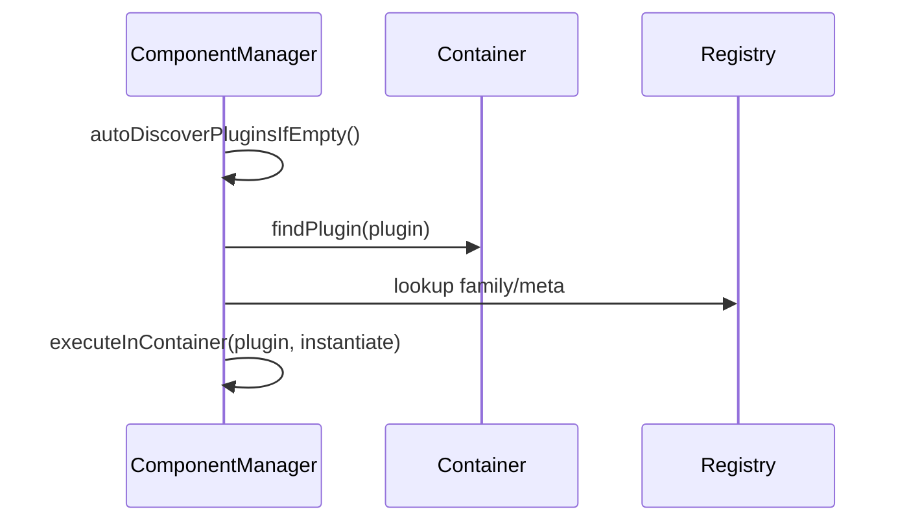

# Talend Component Runtime — TCK Container Loading and Classloader Isolation

This document describes how the ComponentManager loads TCK containers (plugins) and how classloader isolation is enforced. It summarizes supported loading scenarios and the class/resource resolution rules, based on the code in `component-runtime-manager` and `container-core`.

- Key classes:
  - `org.talend.sdk.component.runtime.manager.ComponentManager`
  - `org.talend.sdk.component.container.ContainerManager`
  - `org.talend.sdk.component.classloader.ConfigurableClassLoader`
  - `org.talend.sdk.component.runtime.manager.xbean.NestedJarArchive`

## High-level architecture

- ComponentManager owns a ContainerManager and orchestrates discovery, creation, and lookup of component instances.
- ContainerManager creates a per-plugin Container with its own ConfigurableClassLoader to ensure isolation.
- Each Container registers components and services into a `ContainerComponentRegistry` during `onCreate`.

## Plugin discovery and loading

ComponentManager can load plugins (containers) through multiple paths.

### 1) Explicit registration

- `addPlugin(String pluginRootFile)`
  - Accepts a module reference and delegates to `ContainerManager.builder(pluginRootFile).create()`.
- `addWithLocationPlugin(String location, String pluginRootFile)`
  - Uses a display/location id distinct from the physical module.
- `addPlugin(String forcedId, String pluginRootFile)`
  - Forces the container id.

All these funnel into `ContainerManager.ContainerBuilder.create()`.

### 2) Auto-discovery

- `autoDiscoverPlugins(callers, classpath)`
  - Callers: `addCallerAsPlugin()` infers the caller JAR by scanning the current stack trace and TCCL resource URL.
  - Classpath: scans for `TALEND-INF/dependencies.txt` resources on TCCL; for each discovered component root, creates a container if not already present.

## Module resolution — where the classpath can come from

The container module location (the "plugin root") supports several forms. Resolution happens in `ContainerManager.resolve(String path)` and during archive scanning in `ComponentManager.Updater`:

- Direct file path (directory or JAR):
  - If `PathFactory.get(path)` exists, use it.
- Maven coordinates or repository-relative path:
  - `groupId:artifactId:version[:type[:classifier]]` (length > 2) → resolve to `~/.m2/repository` layout.
  - Plain repository-relative path under `rootRepositoryLocation`.
  - Fallback: lib folder heuristic by filename.
- Nested maven repository inside the runtime JAR:
  - If `ConfigurableClassLoader.NESTED_MAVEN_REPOSITORY` resource is present, containers and dependencies can be read from within a nested repository.
  - `ContainerManager` can map logical modules via `TALEND-INF/plugins.properties` when `supportsResourceDependencies = true`.
- Classpath discovery roots:
  - From `TALEND-INF/dependencies.txt` on classpath; deduces module root URL and creates `Archive` accordingly.

## Building the classpath of a container

ContainerManager defines the classpath for each Container by combining:

- Built-in classpath from the resolver:
  - `resolver.resolve(parentCL, moduleLocation)` populates artifacts based on `TALEND-INF/dependencies.txt` of the module or custom resolvers.
- Additional classpath contributions:
  - ComponentManager queries all `ContainerClasspathContributor` services and passes their `findContributions(pluginId)` to the builder.

The end result is an array of `Artifact` entries provided to the `Container` constructor.

## Classloader isolation

Each container gets its own `ConfigurableClassLoader` (child of the ComponentManager’s parent classloader). Isolation rules are configured in `ContainerManager.ClassLoaderConfiguration` and in `ComponentManager`:

- Parent and container class filters:
  - `parentClassesFilter`: classes that must be loaded from the parent (ComponentManager/runtime side).
  - `classesFilter`: classes that must be loaded from the container (component plugin side).
  - ComponentManager builds a `FilterList` covering container-provided APIs/packages:
    - `org.talend.sdk.component.api.*`
    - `org.talend.sdk.component.spi.*`
    - `javax.annotation.*`
    - `javax.json.*`
    - `org.talend.sdk.component.classloader.*`
    - `org.talend.sdk.component.runtime.*`
    - `org.talend.sdk.component.container.*`
    - `org.talend.sdk.component.dependencies.*`
    - `org.slf4j.*`
    - `org.apache.johnzon.*`
    - Plus any entries provided by `Customizer.containerClassesAndPackages()` and the system property `talend.component.manager.classloader.container.classesAndPackages`.
- Resource dependencies:
  - `supportsResourceDependencies = true` enables nested plugin mapping via `TALEND-INF/plugins.properties` and nested repository resolution.
- Context classloader switching:
  - ComponentManager wraps instantiation and lifecycle calls with `executeInContainer(plugin, supplier)` which sets TCCL to the container’s classloader.

### What loads from where

Rules summarized:

- Parent classloader (runtime side) loads:
  - Runtime implementation and SPI: `org.talend.sdk.component.runtime.*`, container framework classes, JSON/JNZN providers, SLF4J, etc.
  - Any class/package declared by customizers or system property additions to the container classes filter.
- Container classloader loads:
  - Component families, mappers, processors, driver runners, user services annotated with `@Service`, and their transitive dependencies as resolved by `dependencies.txt` and contributors.
  - Resources in the component JARs including `META-INF/services` used by the component.

Note: The exact loading behavior is enforced by `ConfigurableClassLoader` and the filter predicates.

## Container lifecycle and registry population

During `Container.onCreate` (via listeners), `ComponentManager.Updater` performs:

1. Archive selection and scanning:
   - Builds an `Archive` for the module root (file, jar, or nested jar) and possibly additional `Archive`s for dependencies found via `dependenciesResource` (`TALEND-INF/dependencies.txt`).
   - Applies a scanning filter from `TALEND-INF/scanning.properties` if present (include/exclude patterns), or defaults to `KnownClassesFilter`.
   - Optimizes scanning when `classes.list` is provided in scanning.properties.
2. Service creation:
   - Internationalized services, HTTP clients via `HttpClientFactory`, user `@Service` classes; injection via `Injector`, lifecycle `@PostConstruct` invoked.
3. Component registration:
   - For each `@PartitionMapper`, `@Emitter`, `@Processor`, `@DriverRunner`, builds parameter metadata, wraps instances, optional migration handlers, and registers in `ContainerComponentRegistry`.
4. Extensions:
   - Optional `GenericComponentExtension` may override instance instantiation.
5. Close:
   - On `Container.close`, `@PreDestroy` on services is invoked and resources (e.g., `Jsonb`) are closed.

## Supported loading cases summary

- Direct component module path:
  - Directory or JAR file.
- Maven coordinates and repository path:
  - Resolved under local maven repository (`~/.m2/repository`) or provided root.
- Nested maven repository inside runtime:
  - Reads modules and dependencies from the `MAVEN-INF/repository` within the runtime; supports `nested:` URLs.
- Auto-discovery via classpath:
  - Components discovered by the presence of `TALEND-INF/dependencies.txt` in the TCCL resources.
- Caller-based discovery:
  - Infers the caller module from the current stack and `ClassLoader.getResource()` URL, then registers.
- Additional classpath contributions:
  - `ContainerClasspathContributor` services can extend a container’s classpath.

## Isolation guarantees

- Each plugin is loaded in its own `ConfigurableClassLoader` instance.
- Shared runtime classes are loaded via the parent classloader according to `parentClassesFilter` and package prefixes.
- Plugin-specific classes and resources are confined to the container’s classloader, avoiding leakage across containers.
- ComponentManager always switches TCCL to the container’s loader for instantiation and lifecycle, preventing accidental parent-side resolution.
- Transformers and extensions are applied per container, not globally.

## Configuration knobs

- System properties:
  - `talend.component.manager.plugins.parallel`: Parallelize initial plugin additions.
  - `talend.component.manager.classpathcontributor.skip`: Skip loading `ContainerClasspathContributor`s.
  - `talend.component.manager.jmx.skip`: Skip JMX registration of containers.
  - `talend.component.manager.localconfiguration.skip`: Skip LocalConfiguration SPI discovery.
  - `talend.component.manager.classloader.container.classesAndPackages`: Comma-separated list of classes/packages treated as container-provided.
  - `component.manager.callers.skip`: Skip caller-based auto-discovery.
  - `component.manager.classpath.skip`: Skip classpath-based auto-discovery.
  - `talend.checkpoint.enabled`: Enable checkpoint configuration merge for mappers.
  - `talend.component.manager.log.info`: Adjust info-level logging mapping.
- Scanning configuration (per container JAR):
  - `TALEND-INF/scanning.properties` supports:
    - `classloader.includes`, `classloader.excludes` patterns.
    - `classloader.filter.strategy`: `include-exclude` or `exclude-include`.
    - `classes.list`: explicit class list to speed scanning.
- Nested plugin mapping:
  - `TALEND-INF/plugins.properties` maps logical module names to nested locations when `supportsResourceDependencies=true`.

## Practical flows

### Creating and using a component instance

- Find or create a plugin container (`addPlugin` or auto-discovery).
- ComponentManager uses either:
  - Generic instantiation via `GenericComponentExtension`, or
  - Deployed instantiation via `ComponentInstantiator` against the registry.
- TCCL is set to the container loader during instantiation and runtime calls.

## Notes and edge cases

- Duplicate generic extensions are forbidden for a single container.
- Conflicts within a component family (duplicate mapper/processor/driver names) cause errors.
- When scanning with nested repositories, the code guards against duplicate jars accessible via both file and nested paths.
- When `dependencies.txt` resolves to no components, `addJarContaining` removes the container.

## References in code

- `ComponentManager` constructor configures filters, services, and ContainerManager.
- `ComponentManager.Updater`: the ContainerListener that scans, registers, and cleans up.
- `ContainerManager.ContainerBuilder.create()`: resolves module location, builds classpath, constructs `Container` with `ConfigurableClassLoader`, and triggers listeners.
- `ContainerManager.resolve(String)`: handles file, maven coordinates, nested repository, and fallback resolution.
- `ConfigurableClassLoader.NESTED_MAVEN_REPOSITORY`: marker path for embedded dependencies.