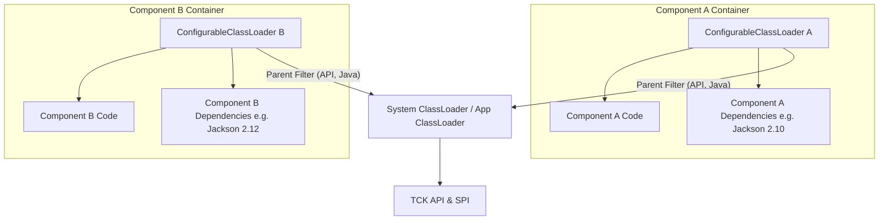
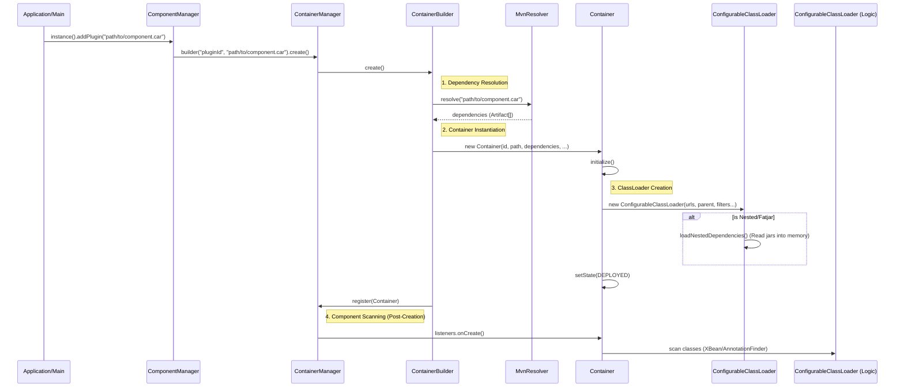
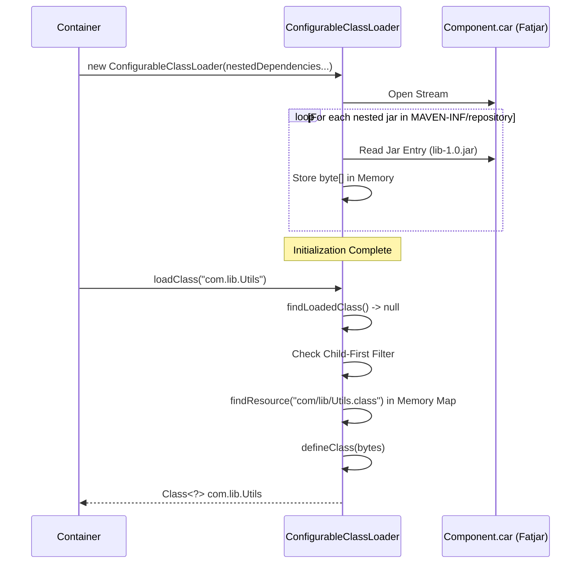

# Talend Component Kit (TCK) Isolation and Classloading

The Talend Component Kit (TCK) achieves component isolation through a dedicated containerization mechanism managed by the `ComponentManager`. This ensures that components do not interfere with each other or with the host application's dependencies.

## 1. Isolation Mechanism

Isolation is primarily implemented using a custom ClassLoader hierarchy. Each component (or "plugin") is loaded in its own separated `Container`, which holds a specific `ConfigurableClassLoader`.

### Core Components
*   **`ContainerManager`**: The orchestrator that manages the lifecycle of all containers.
*   **`Container`**: Represents a single isolated environment for a component family. It holds the reference to the `ConfigurableClassLoader`.
*   **`ConfigurableClassLoader`**: A specialized `URLClassLoader` that enforces isolation policies.

### How it works
The `ConfigurableClassLoader` is the gatekeeper. It is configured with:
1.  **Parent ClassLoader**: Usually the application's classloader (System ClassLoader or the container's logic loader).
2.  **Parent Filter (`Predicate<String>`)**: Defines which classes **must** be loaded from the parent. This typically includes JDK classes (`java.*`, `javax.*`), TCK API classes (`org.talend.sdk.component.api.*`), and common logging frameworks.
3.  **Child-First Strategy**: By default (or when configured), the loader looks for classes in its own classpath *before* delegating to the parent. This allows a component to use a different version of a library than the one used by the platform.

Classes not matching the parent filter and not found in the component's classpath will trigger a `ClassNotFoundException`, effectively hiding the rest of the host's classpath from the component.

## 2. Container Loading Process

The following sequence diagram illustrates how a container is created and loaded. This process involves the `ComponentManager` identifying the plugin, the `Resolver` finding dependencies, and the `Container` initializing the isolated classloader.

## 3. Classes and Dependencies Loading details

Dependencies are determined during the `Resolver` phase.

1.  **Resolution**: The `MvnDependencyListLocalRepositoryResolver` (or other `Resolver` implementations) resolves the list of required artifacts. It parses `mvn dependency:list` output (often found in `TALEND-INF/dependencies.txt`) to know exactly which jars are needed.
2.  **Classpath Construction**: The resolved artifacts are converted to `URL`s.
3.  **ClassLoader Initialization**: The `ConfigurableClassLoader` is instantiated with these URLs.

## 4. Nested Jar Loading (Fatjar Support)

TCK supports loading components from a single "Fatjar" (or nested structure) without extracting files to disk.

### The Mechanism
1.  **Structure**: Inside the fatjar, dependencies are stored in a specific path, typically `MAVEN-INF/repository/`.
2.  **Detection**: If a module is identified as `nested:` or has a nested repository, the `Container` activates the nested loading logic.
3.  **In-Memory Loading**:
    *   The `ConfigurableClassLoader.loadNestedDependencies` method reads inner jars **into memory** (`byte[]`).
    *   It stores these byte arrays in a map: `Map<String, Collection<Resource>> resources`.
    
### Runtime Access
When a class or resource is requested from a nested jar:
1.  The `ConfigurableClassLoader` checks its in-memory `resources` map.
2.  If found, it returns a `ByteArrayInputStream` wrapping the stored bytes.
3.  It constructs a special URL (e.g., `nested:` protocol) to represent these in-memory resources.

