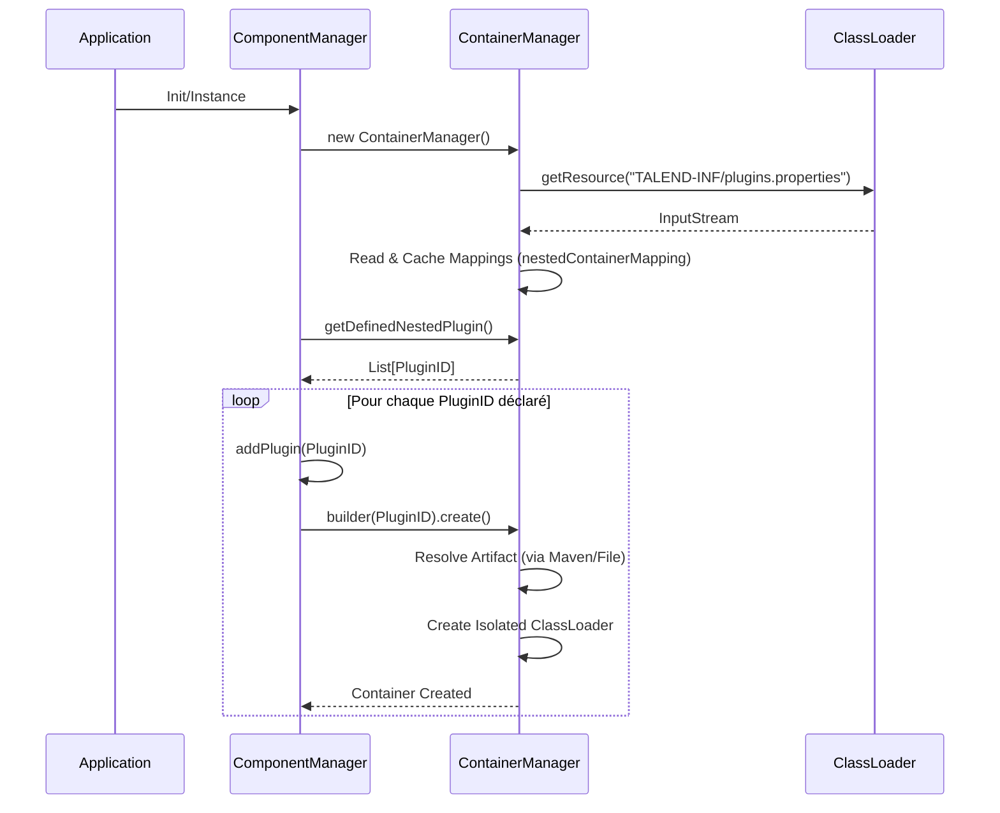

# Mécanisme de Chargement des Plugins TCK (Talend Component Kit)

Ce document détaille le processus de découverte et de chargement des plugins (composants) dans l'écosystème Talend Component Kit (TCK). Le mécanisme repose principalement sur deux stratégies : une déclaration explicite via `plugins.properties` et une auto-découverte dynamique.

## 1. Vue d'ensemble

Le chargement des plugins est orchestré par le `ComponentManager` qui délègue la gestion des conteneurs isolés au `ContainerManager`. L'objectif est de charger chaque plugin dans son propre `ClassLoader` pour garantir l'isolation des dépendances.

### Acteurs Principaux
- **ComponentManager** : Point d'entrée singleton, coordonne l'ensemble du cycle de vie.
- **ContainerManager** : Gère la création et le stockage des conteneurs (un par plugin).
- **Plugins/Conteneurs** : Unités isolées contenant le code du composant.

## 2. Le Fichier `plugins.properties`

C'est la méthode explicite ou "statique" pour déclarer des plugins, particulièrement utilisée dans les environnements packagés (comme les fatjars ou les applications autonomes).

*   **Localisation par défaut** : `TALEND-INF/plugins.properties` (dans le classpath du chargeur parent).
*   **Format** : Propriétés Java standard `clé=valeur`.
    *   **Clé** : ID du plugin (souvent le nom de l'artefact).
    *   **Valeur** : Coordonnées du module (ex: coordonnées Maven `mvn:groupId/artifactId/version` ou chemin fichier).

### Processus de Chargement
Lors de l'initialisation du `ContainerManager` :
1.  Il recherche la ressource `TALEND-INF/plugins.properties`.
2.  Il lit les entrées et alimente une map interne `nestedContainerMapping`.
3.  Le `ComponentManager` itère ensuite sur ces définitions pour déclencher le chargement effectif des plugins.



## 3. Auto-découverte (Service Loader & Markers)

En l'absence de déclaration explicite, ou en complément, TCK peut découvrir des composants présents dans le classpath.

### Mécanismes
1.  **Marqueurs Maven** : Le `ContainerManager` scanne les ressources `META-INF/maven/org.talend.sdk.component/` pour identifier les modules de composants disponibles.
2.  **Appelant (Caller)** : La méthode `ComponentManager.addCallerAsPlugin()` tente d'identifier le JAR ou le dossier de classes qui a invoqué le manager et l'enregistre dynamiquement comme un plugin si ce n'est pas déjà fait.
3.  **StandaloneContainerFinder** : Dans certains modes d'exécution, si un plugin demandé n'est pas trouvé, le système tente de le résoudre dynamiquement en supposant qu'il est présent dans le classpath ou dans un dépôt imbriqué via le `plugins.properties`.

```mermaid
flowchart TD
    Start([Démarrage ComponentManager]) --> InitCM[Initialisation]
    InitCM --> LoadProps{plugins.properties présent ?}
    
    LoadProps -- Oui --> ReadProps[Lecture TALEND-INF/plugins.properties]
    ReadProps --> MapPlugins[Enregistrement mappings ID -> Location]
    LoadProps -- Non --> AutoDisc[Mode Auto-découverte uniquement]
    
    MapPlugins --> Iterate[Itération sur les plugins définis]
    Iterate --> CreateCont[Création Conteneur Isolé]
    
    AutoDisc --> ScanCP[Scan Classpath]
    ScanCP --> CheckMarker{Marqueur Maven trouvé ?}
    CheckMarker -- Oui --> RegMarker[Enregistrement du Plugin trouvé]
    
    InitCM --> AddCaller[addCallerAsPlugin()]
    AddCaller --> CheckSelf{Appelant est un composant ?}
    CheckSelf -- Oui --> RegCaller[Enregistrement de l'Appelant]
    
    CreateCont --> Final([Plugins Chargés & Isolés])
    RegMarker --> Final
    RegCaller --> Final
```

## 4. Résolution des Artefacts

Qu'il soit découvert ou déclaré, un plugin doit être "résolu" pour récupérer son JAR et ses dépendances.
Le `ContainerManager` utilise un résolveur (souvent basé sur Maven) :
- Si l'ID est une coordonnée Maven (`mvn:...`), il cherche dans le dépôt local (`.m2`) ou un dépôt imbriqué.
- Si l'ID est un chemin fichier, il charge directement.

> [!NOTE]
> Dans le cas des fatjars générés par les outils Talend, les dépendances sont souvent incluses à l'intérieur du fatjar dans un dossier `MAVEN-INF` ou similaire, et `plugins.properties` fait le lien vers ces ressources internes.
